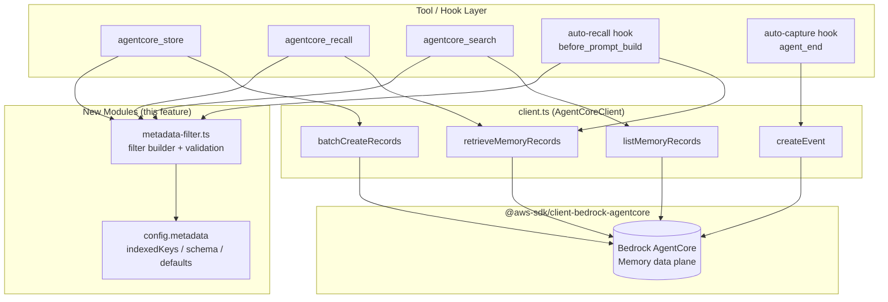
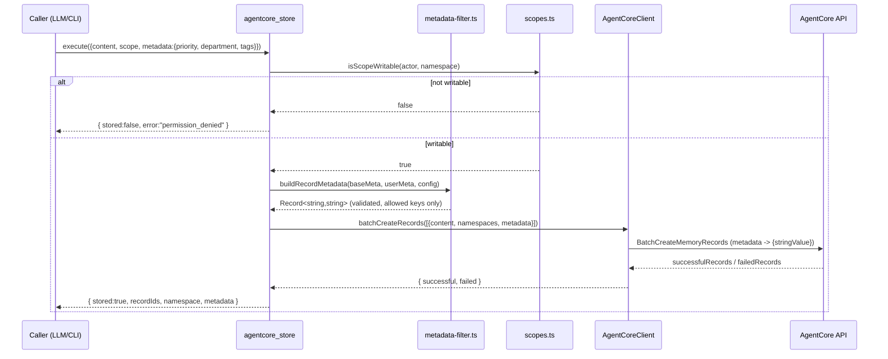
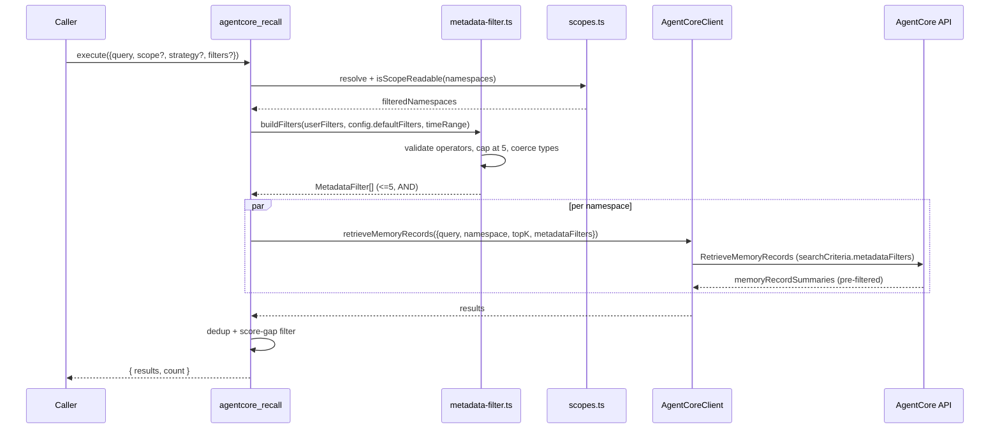

# Design Document: Structured Metadata Filtering

## Overview

This feature adds AWS Bedrock AgentCore Memory's **structured metadata filtering** and
**strictly-consistent (deterministic) metadata** to the `memory-agentcore` OpenClaw plugin.
Today the plugin isolates memories only by *namespace* (`/semantic/{actor}`, `/users/{peer}`,
etc.). Within a namespace, a semantic recall returns everything close in meaning. By attaching
structured attributes (priority, department, channel, tags, time range) to records and applying
`metadataFilters` at retrieval time, the plugin can narrow results *inside* a namespace — a
strict precision improvement layered on top of the existing scope model, not a replacement for it.

The change is deliberately **additive and backward-compatible**. The AWS SDK
(`@aws-sdk/client-bedrock-agentcore ^3.1004.0`) already accepts `metadataFilters` on both
`RetrieveMemoryRecordsCommand` (nested under `searchCriteria`) and `ListMemoryRecordsCommand`
(top-level). The plugin's `client.ts` already maps a `Record<string,string>` of metadata onto
the `{ stringValue }` shape for `CreateEvent` and `BatchCreateMemoryRecords`, and reads it back.
The core gap is that the retrieve/list calls never *pass* a filter, and there is no config surface
for declaring which keys are filterable or which values are deterministic. This design closes those
gaps in `client.ts`, `config.ts`, `store.ts`, `recall.ts`, `search.ts`, and the auto-recall /
auto-capture hooks in `index.ts`.

A key operational constraint drives the design: **indexed keys must be declared at
memory-creation time** (`CreateMemory.indexedKeys`) and **cannot be removed**. The plugin does not
provision the memory resource (`memoryId` is supplied in config), and it must **not** silently take
over provisioning. Therefore the design treats indexed-key declaration and per-strategy metadata
schemas as an **externally-owned setup concern** (documented + validated), while the plugin owns the
runtime path: attaching metadata on write and applying filters on read, degrading gracefully when a
memory resource lacks the expected indexed keys.

### Verified API facts (AWS docs + SDK 3.1004.x)

- `RetrieveMemoryRecords`: filters live at `searchCriteria.metadataFilters` (semantic search with pre-filter).
- `ListMemoryRecords`: filters live at the top-level `metadataFilters` parameter (no semantic search).
- A filter is a `{ left: { metadataKey }, operator, right?: { metadataValue } }` expression.
- **Max 5 filters per query**, combined with **AND** logic.
- Operators: `EQUALS_TO`, `CONTAINS` (STRINGLIST), `EXISTS`, `NOT_EXISTS`, `GREATER_THAN`,
  `GREATER_THAN_OR_EQUALS`, `LESS_THAN`, `LESS_THAN_OR_EQUALS`, `BEFORE`, `AFTER`.
- `metadataValue` variants: `stringValue`, `numberValue`, `stringListValue`, `dateTimeValue`.
- Indexed keys: up to **10 per memory**, types `STRING | STRINGLIST | NUMBER`; declared at
  `CreateMemory` or added via `UpdateMemory`; **cannot be removed**.
- System timestamp keys `x-amz-agentcore-memory-createdAt` / `updatedAt` (type `dateTimeValue`) are
  filterable **without** declaring any indexed key.
- Strictly-consistent keys: `extractionType: "STRICTLY_CONSISTENT"`; **max 3 per strategy**; must be
  `STRING`; must also be an indexed key; no `extractionConfig`; supported on semantic /
  user-preference / episodic strategies (**not summary**); value is copied verbatim from the event.
- Event metadata (`CreateEvent`) accepts **only** `stringValue`. Records support `stringValue`,
  `stringListValue`, `numberValue`; `dateTimeValue` is reserved for system fields.

---

## Architecture



**Design principles**

1. **Namespace-first, filter-second.** Filters compose *within* the namespaces already resolved by
   `scopes.ts`. Filtering never widens access; it only narrows an already-authorized result set.
2. **Single filter-construction path.** All tools/hooks build filters through one module
   (`metadata-filter.ts`) so operator validation, the 5-filter cap, and type coercion live in one place.
3. **Graceful degradation.** If a memory resource lacks an expected indexed key, the plugin logs a
   warning and either skips the offending filter (configurable) or returns the API error verbatim —
   it never crashes the recall/store pipeline.
4. **Provisioning stays external.** The plugin reads/validates indexed-key configuration but does not
   call `CreateMemory`/`UpdateMemory` by default (an optional, explicitly-opt-in setup CLI is proposed).

---

## Sequence Diagrams

### Store with structured + strictly-consistent metadata



### Recall with metadata pre-filter



---

## Components and Interfaces

### Component 1: `metadata-filter.ts` (new module)

**Purpose**: The single source of truth for constructing, validating, and capping metadata filters,
and for building the metadata attached to written records. Pure functions, no AWS/network calls —
fully unit-testable.

**Interface**:

```typescript
// A user/tool-facing filter (loose input shape).
export interface MetadataFilterInput {
  key: string;
  operator?: FilterOperator;      // default inferred from value / EQUALS_TO
  value?: string | number | string[]; // omitted for EXISTS / NOT_EXISTS
}

// The canonical wire shape passed to the SDK.
export interface MetadataFilter {
  left: { metadataKey: string };
  operator: FilterOperator;
  right?: { metadataValue: MetadataValue };
}

export type FilterOperator =
  | "EQUALS_TO" | "CONTAINS" | "EXISTS" | "NOT_EXISTS"
  | "GREATER_THAN" | "GREATER_THAN_OR_EQUALS"
  | "LESS_THAN" | "LESS_THAN_OR_EQUALS"
  | "BEFORE" | "AFTER";

export type MetadataValue =
  | { stringValue: string }
  | { numberValue: number }
  | { stringListValue: string[] }
  | { dateTimeValue: string }; // ISO-8601 UTC

export interface BuildFiltersOptions {
  userFilters?: MetadataFilterInput[];
  defaultFilters?: MetadataFilterInput[]; // from config
  createdAfter?: string | Date;           // convenience -> x-amz-agentcore-memory-createdAt AFTER
  createdBefore?: string | Date;          // convenience -> ...createdAt BEFORE
  indexedKeys?: IndexedKeyConfig[];        // for filterability validation
}

export interface BuildFiltersResult {
  filters: MetadataFilter[];   // length <= 5, deduped, AND-combined
  dropped: DroppedFilter[];    // filters removed with reason (over cap / not indexed / invalid)
}
```

**Responsibilities**:
- Normalize `MetadataFilterInput` → `MetadataFilter` (choose value variant by type / operator).
- Enforce operator/type compatibility (e.g. `CONTAINS` requires `STRINGLIST`; `BEFORE/AFTER` require a
  `dateTimeValue`; `EXISTS/NOT_EXISTS` carry no `right`).
- Enforce the **max-5** cap deterministically (defaults first, then user filters, timestamp filters counted).
- Optionally validate each `metadataKey` against configured `indexedKeys` (+ the always-allowed system
  timestamp keys) and record any dropped filter with a reason.
- `buildRecordMetadata(...)`: merge base metadata (category, scope, source, tags, userId) with
  user-supplied structured + strictly-consistent metadata, dropping keys not permitted by config and
  validating `allowedValues` where configured.

### Component 2: `AgentCoreClient` (extend `client.ts`)

**Purpose**: Pass `metadataFilters` through to the SDK on read paths; unchanged write mapping.

**Interface** (additions in **bold** conceptually):

```typescript
export interface SearchOptions {
  query: string;
  namespace: string;
  topK?: number;
  strategyId?: string;
  metadataFilters?: MetadataFilter[]; // NEW
}

export interface ListRecordsOptions {
  namespace: string;
  strategyId?: string;
  maxResults?: number;
  nextToken?: string;
  metadataFilters?: MetadataFilter[]; // NEW
}
```

**Responsibilities**:
- On `retrieveMemoryRecords`, nest `metadataFilters` inside `searchCriteria` only when non-empty.
- On `listMemoryRecords`, add top-level `metadataFilters` only when non-empty.
- Preserve existing behavior exactly when no filters are supplied (spread-only-when-present pattern,
  matching the current `...(options.topK ? {...} : {})` style).

### Component 3: Tools & hooks (extend `store.ts`, `recall.ts`, `search.ts`, `index.ts`)

**Purpose**: Expose `metadata` (write) and `filters` (read) parameters, wire them through
`metadata-filter.ts`, and apply config-driven default filters.

**Responsibilities**:
- `agentcore_store`: accept optional `metadata` object + `strictMetadata` object; merge via
  `buildRecordMetadata`.
- `agentcore_recall` / `agentcore_search`: accept optional `filters` array + `created_after` /
  `created_before`; build via `buildFilters`; surface `dropped` filters in the `details` payload.
- Auto-recall hook: apply `config.metadata.defaultRecallFilters` (e.g. pin to current `userId`).
- Auto-capture hook: attach `config.metadata.strictKeys` values (e.g. `agentId`, `userId`) as event
  metadata so deterministic grouping works during extraction.

### Component 4: Config surface (extend `config.ts`)

**Purpose**: Declare indexed keys, per-strategy metadata schema (for docs/validation/optional
provisioning), default filters, and enable flags.

---

## Data Models

### Model: `MetadataConfig` (added to `PluginConfig`)

```typescript
export interface IndexedKeyConfig {
  key: string;
  type: "STRING" | "STRINGLIST" | "NUMBER";
}

export interface MetadataSchemaEntry {
  key: string;
  type: "STRING" | "STRINGLIST" | "NUMBER";
  extractionType?: "LLM_INFERRED" | "STRICTLY_CONSISTENT"; // default LLM_INFERRED
  definition?: string;            // required by AWS for LLM_INFERRED
  allowedValues?: string[];       // -> stringValidation.allowedValues (max 10)
}

export interface MetadataConfig {
  enabled: boolean;                       // master switch (default false = current behavior)
  indexedKeys: IndexedKeyConfig[];        // declared keys (<=10); informational + validation
  schemaByStrategy: Partial<Record<MemoryStrategy, MetadataSchemaEntry[]>>;
  strictKeys: string[];                   // subset of indexedKeys treated as deterministic (<=3/strategy)
  defaultRecallFilters: MetadataFilterInput[]; // applied automatically on recall/auto-recall
  dropUnindexedFilters: boolean;          // true = skip filters on unknown keys; false = pass through
}
```

**Validation Rules**:
- `indexedKeys.length <= 10`; keys match `^[a-zA-Z0-9\s._:/=+@-]{0,128}$`.
- `strictKeys` ⊆ `indexedKeys` keys; each strict key has `type === "STRING"`; ≤ 3 per strategy schema.
- `schemaByStrategy` must not include `SUMMARY` for strict keys (unsupported by AWS).
- `allowedValues.length <= 10`, each ≤ 256 chars matching the same charset.
- When `enabled === false`, all read/write paths behave exactly as today (feature is inert).

**Env / raw resolution** follows the existing `resolveConfig` conventions:
`AGENTCORE_METADATA_ENABLED`, `AGENTCORE_METADATA_INDEXED_KEYS` (comma list of `key:type`),
`AGENTCORE_METADATA_STRICT_KEYS` (comma list); complex objects (`schemaByStrategy`,
`defaultRecallFilters`) come from `raw` plugin config only.

### Model: system timestamp keys (constants)

```typescript
export const SYSTEM_TIMESTAMP_KEYS = {
  createdAt: "x-amz-agentcore-memory-createdAt",
  updatedAt: "x-amz-agentcore-memory-updatedAt",
} as const;

// Always filterable regardless of indexedKeys config.
export const ALWAYS_FILTERABLE_KEYS: readonly string[] = [
  SYSTEM_TIMESTAMP_KEYS.createdAt,
  SYSTEM_TIMESTAMP_KEYS.updatedAt,
  "x-amz-agentcore-memory-recordType",
];
```

---

## Algorithmic Pseudocode

### `buildFilters` — construct a capped, validated AND-filter list

```pascal
ALGORITHM buildFilters(options)
INPUT: options of type BuildFiltersOptions
OUTPUT: result of type BuildFiltersResult

BEGIN
  ASSERT options <> NULL

  candidates ← EMPTY LIST
  dropped    ← EMPTY LIST

  // 1. Deterministic ordering: config defaults first, then explicit user filters,
  //    then convenience timestamp bounds. Order fixes which filters survive the cap.
  FOR each f IN options.defaultFilters DO candidates.append(tag(f, "default")) END FOR
  FOR each f IN options.userFilters    DO candidates.append(tag(f, "user"))    END FOR
  IF options.createdAfter  <> NULL THEN candidates.append(timestampFilter(createdAt, AFTER,  options.createdAfter))  END IF
  IF options.createdBefore <> NULL THEN candidates.append(timestampFilter(createdAt, BEFORE, options.createdBefore)) END IF

  // 2. Normalize + validate each candidate independently.
  normalized ← EMPTY LIST
  FOR each c IN candidates DO
    outcome ← normalizeOne(c, options.indexedKeys)
    IF outcome.ok THEN
      normalized.append(outcome.filter)
    ELSE
      dropped.append({ input: c, reason: outcome.reason })
    END IF
  END FOR

  // 3. Dedup by (metadataKey, operator, serialized value); keep first occurrence.
  deduped ← EMPTY LIST
  seen    ← EMPTY SET
  FOR each n IN normalized DO
    k ← key(n.left.metadataKey, n.operator, serialize(n.right))
    IF NOT seen.contains(k) THEN
      seen.add(k)
      deduped.append(n)
    END IF
  END FOR

  // 4. Enforce the hard AWS cap of 5 filters (AND logic).
  ASSERT invariant: for all i, deduped[0..i] are valid MetadataFilter
  IF deduped.length > 5 THEN
    FOR each extra IN deduped[5 .. end] DO
      dropped.append({ input: extra, reason: "exceeds_max_5_filters" })
    END FOR
    deduped ← deduped[0 .. 4]
  END IF

  RETURN { filters: deduped, dropped: dropped }
END
```

**Preconditions**:
- `options` is defined; each `MetadataFilterInput` has a non-empty `key`.
- `indexedKeys` (if provided) is a valid list of `{key,type}`.

**Postconditions**:
- `result.filters.length <= 5`.
- Every element of `result.filters` is a structurally valid `MetadataFilter`
  (has `left.metadataKey`, a supported `operator`, and a `right.metadataValue` iff the operator requires one).
- Every rejected/over-cap input appears exactly once in `result.dropped` with a reason.
- Filters are AND-combined by the API; the function neither reorders survivors nor mutates inputs.

**Loop invariants**:
- After step 2, `normalized` contains only structurally valid filters; all others are in `dropped`.
- After step 3, `deduped` contains no two filters with identical `(key, operator, value)`.
- After step 4, `deduped.length <= 5` and every previously-valid survivor remains valid.

### `normalizeOne` — coerce one input to a wire filter

```pascal
ALGORITHM normalizeOne(input, indexedKeys)
INPUT: input of type (MetadataFilterInput tagged with source)
       indexedKeys of type list<IndexedKeyConfig> (may be empty)
OUTPUT: { ok: boolean, filter?: MetadataFilter, reason?: string }

BEGIN
  IF input.key = "" THEN RETURN { ok:false, reason:"empty_key" } END IF

  operator ← input.operator OR inferOperator(input.value)  // EXISTS if no value & no op

  IF NOT isSupportedOperator(operator) THEN
    RETURN { ok:false, reason:"unsupported_operator" }
  END IF

  // Filterability check: key must be a declared indexed key OR an always-filterable system key.
  IF indexedKeys.nonEmpty() AND NOT isFilterable(input.key, indexedKeys) THEN
    IF config.dropUnindexedFilters THEN
      RETURN { ok:false, reason:"key_not_indexed" }
    END IF
    // else fall through and let the API decide (pass-through mode)
  END IF

  IF operator IN {EXISTS, NOT_EXISTS} THEN
    RETURN { ok:true, filter:{ left:{metadataKey:input.key}, operator } }  // no right
  END IF

  IF input.value = NULL THEN RETURN { ok:false, reason:"missing_value" } END IF

  metadataValue ← coerceValue(operator, input.value)   // see table below
  IF metadataValue = NULL THEN
    RETURN { ok:false, reason:"operator_value_type_mismatch" }
  END IF

  RETURN { ok:true, filter:{ left:{metadataKey:input.key}, operator, right:{ metadataValue } } }
END
```

**Operator → value-variant coercion**

| Operator | Accepted `value` | Emitted `metadataValue` |
|---|---|---|
| `EQUALS_TO` | string / number | `{stringValue}` or `{numberValue}` |
| `CONTAINS` | string | `{stringValue}` (matched against a STRINGLIST field) |
| `GREATER_THAN`, `GREATER_THAN_OR_EQUALS`, `LESS_THAN`, `LESS_THAN_OR_EQUALS` | number | `{numberValue}` |
| `BEFORE`, `AFTER` | ISO string / Date | `{dateTimeValue}` (normalized to UTC ISO-8601) |
| `EXISTS`, `NOT_EXISTS` | — | *(no `right`)* |

### `buildRecordMetadata` — assemble validated write metadata

```pascal
ALGORITHM buildRecordMetadata(base, userMeta, strictMeta, config)
INPUT: base       of type Record<string,string>   // category, scope, source, tags, userId
       userMeta   of type Record<string, string|number|string[]> (LLM-inferred / free)
       strictMeta of type Record<string,string>   // deterministic values
       config     of type MetadataConfig
OUTPUT: Record<string,string>   // event-metadata shape (stringValue-only on CreateEvent)

BEGIN
  result ← COPY(base)

  // Strict keys: pass through verbatim, but only if declared as indexed + strict.
  FOR each (k, v) IN strictMeta DO
    IF k IN config.strictKeys THEN
      result[k] ← v          // no transformation; deterministic grouping relies on exact value
    ELSE
      WARN "strict key not configured, ignored: " + k
    END IF
  END FOR

  // Free/user metadata: keep only keys that are indexed or schema-defined; validate allowedValues.
  FOR each (k, v) IN userMeta DO
    IF isKnownKey(k, config) THEN
      s ← stringify(v)                       // arrays -> JSON for event metadata (stringValue-only)
      IF hasAllowedValues(k, config) AND s NOT IN allowedValues(k, config) THEN
        WARN "value not in allowedValues, dropped: " + k + "=" + s
      ELSE
        result[k] ← s
      END IF
    ELSE
      WARN "unknown metadata key dropped: " + k
    END IF
  END FOR

  RETURN result
END
```

**Preconditions**: `config` is valid (passed `validateMetadataConfig`); `base` contains no reserved
`x-amz-*` keys.
**Postconditions**: every returned key is either a base key, a configured strict key, or a known
indexed/schema key; no value violates a configured `allowedValues` set; result is a flat
`Record<string,string>` suitable for the existing `{stringValue}` mapping in `client.ts`.

---

## Key Functions with Formal Specifications

### `AgentCoreClient.retrieveMemoryRecords(options)`

```typescript
retrieveMemoryRecords(options: SearchOptions): Promise<MemoryRecordResult[]>
```

**Preconditions**:
- `options.query` is a non-empty string; `options.namespace` is a valid namespace path.
- `options.metadataFilters` (if present) has length ≤ 5 and each element is a valid `MetadataFilter`.

**Postconditions**:
- Sends a `RetrieveMemoryRecordsCommand` where `searchCriteria.metadataFilters` is present **iff**
  `options.metadataFilters` is non-empty.
- When `metadataFilters` is empty/absent, the emitted command is byte-identical to today's behavior.
- Returns only records satisfying **all** supplied filters (AND) among the semantic top-K.

### `AgentCoreClient.listMemoryRecords(options)`

```typescript
listMemoryRecords(options: ListRecordsOptions): Promise<{ records: MemoryRecordResult[]; nextToken?: string }>
```

**Preconditions**: `options.namespace` valid; `metadataFilters` (if present) length ≤ 5, all valid.
**Postconditions**: top-level `metadataFilters` present iff non-empty; returned records satisfy all
filters; pagination via `nextToken` unchanged.

### `validateMetadataConfig(config)`

```typescript
validateMetadataConfig(config: MetadataConfig): { valid: boolean; errors: string[] }
```

**Postconditions**: returns `valid === true` iff every rule in *Data Models → Validation Rules* holds;
otherwise `errors` enumerates each violation. Never throws; callers decide whether to disable the
feature (fail-safe) on invalid config.

---

## Example Usage

```typescript
import { buildFilters, buildRecordMetadata, SYSTEM_TIMESTAMP_KEYS } from "../metadata-filter.js";

// --- Recall: high-priority billing records from the current user, created this year ---
const { filters, dropped } = buildFilters({
  userFilters: [
    { key: "priority", operator: "EQUALS_TO", value: "high" },
    { key: "department", operator: "EQUALS_TO", value: "billing" },
  ],
  defaultFilters: config.metadata.defaultRecallFilters, // e.g. [{ key:"userId", value: peerId }]
  createdAfter: "2026-01-01T00:00:00Z",                 // -> x-amz-agentcore-memory-createdAt AFTER
  indexedKeys: config.metadata.indexedKeys,
});

if (dropped.length > 0) {
  // surfaced to the caller in tool `details`, and logged
  api.logger.debug(`[agentcore] [recall] dropped ${dropped.length} filters`);
}

const results = await client.retrieveMemoryRecords({
  query,
  namespace: "/semantic/customer-123",
  topK: limit,
  metadataFilters: filters, // client omits searchCriteria.metadataFilters if empty
});

// --- Store: attach deterministic + free metadata ---
const metadata = buildRecordMetadata(
  { category: "fact", scope: scopeStr, source: "manual" },     // base
  { priority: "high", tags: ["invoice", "duplicate-charge"] }, // free / LLM-inferred
  { department: "billing" },                                   // strictly-consistent
  config.metadata,
);
await client.batchCreateRecords([{ content, namespaces: [namespace], metadata }]);

// --- Search (list, no semantic query): everything critical, most-recent first ---
const listed = await client.listMemoryRecords({
  namespace: "/users/customer-123",
  maxResults: 20,
  metadataFilters: buildFilters({
    userFilters: [{ key: "priority", operator: "EQUALS_TO", value: "critical" }],
    indexedKeys: config.metadata.indexedKeys,
  }).filters,
});
```

---

## Correctness Properties

Let `F` be the set of filters passed and `R` the set of returned records.

1. **Cap invariant**: `∀` calls, `|buildFilters(...).filters| ≤ 5`.
2. **AND soundness**: `∀ r ∈ R, ∀ f ∈ F : satisfies(r, f)`. No returned record violates any filter.
3. **Backward compatibility**: `metadataFilters = ∅ ⟹` emitted SDK command ≡ pre-feature command,
   and `R` ≡ pre-feature result for the same query/namespace.
4. **No privilege escalation**: `R ⊆ namespaceRecords(authorizedNamespaces)`. Filters can only shrink,
   never expand, the namespace-authorized candidate set. (Filtering is orthogonal to `scopes.ts`.)
5. **Determinism of survivors**: given identical input `options`, `buildFilters` yields an identical
   ordered `filters` list (stable ordering: defaults → user → timestamps, dedup keeps first).
6. **Strict-value fidelity**: a value written under a `STRICTLY_CONSISTENT` key equals the value used at
   write time (`buildRecordMetadata` performs no transformation on strict keys).
7. **Idempotent no-op**: if `config.metadata.enabled = false`, both `buildFilters` and
   `buildRecordMetadata` reduce to `filters = ∅` / `metadata = base`.
8. **Timestamp UTC normalization**: any `Date`/ISO input to `BEFORE`/`AFTER` serializes to UTC ISO-8601.

These map to property-based tests (see Testing Strategy).

---

## Error Handling

### Scenario 1: Memory resource lacks an expected indexed key
**Condition**: A filter references a key never declared in the resource's `indexedKeys` (config drift,
or the externally-provisioned memory predates the key).
**Response**: If `dropUnindexedFilters = true`, `buildFilters` drops the filter (recorded in `dropped`)
and the query proceeds with the remaining filters. If `false`, the filter is passed through and any AWS
`ValidationException` is caught per-namespace by the existing `Promise.allSettled` pattern.
**Recovery**: The recall/search still returns results from unaffected namespaces/filters; a warning is
logged and `dropped` is surfaced in tool `details` so the caller can correct config.

### Scenario 2: Too many filters supplied
**Condition**: defaults + user + timestamp filters exceed 5.
**Response**: `buildFilters` keeps the first 5 (deterministic order) and records the rest in `dropped`.
**Recovery**: Query runs with 5 filters; caller sees which were dropped.

### Scenario 3: Operator/value type mismatch
**Condition**: e.g. `GREATER_THAN` with a string, or `CONTAINS` against a non-list key.
**Response**: `normalizeOne` rejects the filter with `reason: "operator_value_type_mismatch"`; it is
dropped before any network call.
**Recovery**: No malformed request is sent; other filters proceed.

### Scenario 4: Invalid metadata config at startup
**Condition**: `validateMetadataConfig` returns errors (e.g. > 10 indexed keys, strict key not indexed).
**Response**: Log errors; if invalid, treat `metadata.enabled` as `false` (fail-safe) so existing
behavior is preserved rather than sending bad requests.
**Recovery**: Plugin continues operating without filtering; operator fixes config and reloads.

### Scenario 5: Value rejected by `allowedValues`
**Condition**: A write supplies a value outside a configured `allowedValues` set.
**Response**: `buildRecordMetadata` drops that key with a warning (does not fail the whole store).
**Recovery**: Record is stored without the invalid metadata key; caller is warned.

---

## Testing Strategy

### Unit Testing
- `metadata-filter.ts` is pure → exhaustive unit tests for `normalizeOne`, `buildFilters`,
  `buildRecordMetadata`, operator/value coercion table, and each `dropped` reason.
- `client.ts`: assert that `retrieveMemoryRecords`/`listMemoryRecords` include `metadataFilters`
  **iff** non-empty (mock the SDK `send`), and that the no-filter command is unchanged.
- Config: `resolveConfig` parses `AGENTCORE_METADATA_*` env + raw objects; `validateMetadataConfig`
  covers each validation rule. Follows the existing `node --test` (`*.test.ts`) convention.

### Property-Based Testing
**Library**: `fast-check` (TypeScript-native; matches the Bun/`tsx --test` runner).

Properties to encode (map to *Correctness Properties*):
- Generate arbitrary filter-input lists → assert `buildFilters().filters.length ≤ 5` (P1).
- Generate inputs + records → assert every survivor is structurally valid and no dropped+survivor
  duplication (P2 structural, P5).
- Generate configs with `enabled=false` → assert `filters=∅` and `metadata=base` (P7).
- Generate `Date`/ISO inputs for `BEFORE/AFTER` → assert output is UTC ISO-8601 (P8).
- Round-trip: `buildRecordMetadata` on strict keys preserves exact values (P6).

### Integration Testing
- Against a test memory resource with declared indexed keys (`priority`, `department`, `tags`,
  `channel`) + a metadata schema: store records, then recall/list with filters and assert the
  returned set honors AND semantics and timestamp bounds.
- Degradation test: point at a memory **without** an indexed key and assert graceful drop/pass-through
  per `dropUnindexedFilters`.

---

## Performance Considerations

- Metadata filtering is **pre-filtering**: AWS applies filters before KNN, shrinking the candidate set,
  so filtered recalls are generally **cheaper or equal** to unfiltered ones — no extra round trips.
- Filter construction is O(n) in the (tiny, ≤5) filter count; negligible vs. network latency.
- The auto-recall hook already fans out across namespaces via `Promise.allSettled`; adding identical
  `metadataFilters` to each parallel call adds no extra requests.
- Because filters narrow within a namespace, they can *reduce* the need to over-fetch `topK` and then
  post-filter client-side, modestly lowering payload sizes.

## Security Considerations

- **Filtering is not authorization.** Namespace/scope checks in `scopes.ts` remain the sole access
  boundary; metadata filters only refine an already-authorized result set (Correctness Property 4).
- Filter keys/values are validated against a charset and (optionally) `allowedValues`, reducing
  injection of arbitrary keys into requests.
- Default recall filters can pin results to the current `userId`/`peerId` as defense-in-depth, but must
  never be the *only* isolation mechanism.
- Strictly-consistent values (e.g. `department`, `compliance_level`) are copied verbatim; treat them as
  trusted, application-supplied classifiers, not user free-text, to avoid deterministic-group pollution.

## Dependencies

- **`@aws-sdk/client-bedrock-agentcore` `^3.1004.0`** (already present) — supplies
  `RetrieveMemoryRecordsCommand` / `ListMemoryRecordsCommand` with `metadataFilters` support. No version
  bump required for the data-plane filtering path.
- **`fast-check`** (new dev dependency) — property-based tests.
- **Optional (setup only)**: `@aws-sdk/client-bedrock-agentcore-control` for an explicitly opt-in
  provisioning/validation CLI (`CreateMemory`/`UpdateMemory` with `indexedKeys` + strategy
  `metadataSchema`). Default plugin behavior does **not** depend on it; indexed-key declaration remains
  an externally-owned setup step documented for operators.

### Open provisioning decision (to resolve in requirements)

Indexed keys cannot be removed and must exist before filters work. Two options:
1. **Documentation-only (recommended default)**: operators declare `indexedKeys` + `metadataSchema` when
   they create the memory resource; the plugin validates presence via `GetMemory` on startup and warns.
2. **Opt-in plugin-managed setup**: a guarded CLI command (`agentcore-metadata-setup`) that calls
   `UpdateMemory` to add missing indexed keys/schema, requiring an explicit `--confirm` flag given the
   irreversibility of indexed-key addition.
