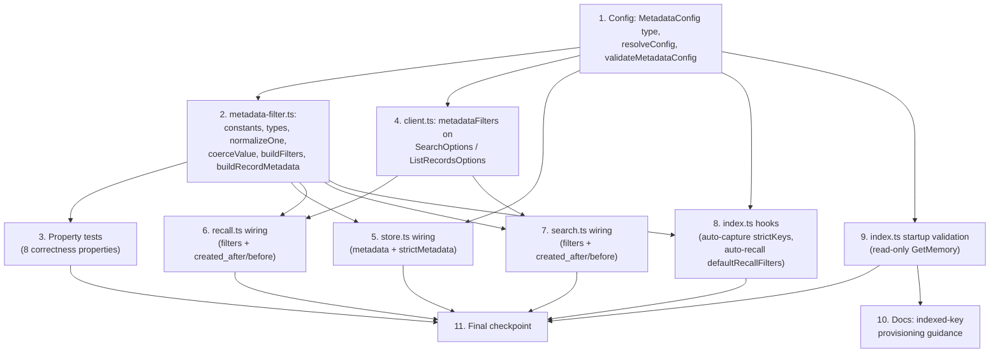

# Implementation Plan: Structured Metadata Filtering

## Overview

This plan implements structured metadata filtering and strictly-consistent metadata for the
`memory-agentcore` plugin in an incremental, test-backed order. The foundation is built first —
the pure `metadata-filter.ts` module and the `MetadataConfig` surface in `config.ts` — because
every downstream tool, hook, and client change depends on them and they carry all 8 correctness
properties from the design. The `AgentCoreClient` read paths are extended next (spread-only wire
plumbing), followed by tool/hook wiring (`store.ts`, `recall.ts`, `search.ts`, `index.ts`), then
read-only startup validation, and finally documentation for the externally-owned indexed-key
provisioning.

Implementation language: **TypeScript** (matching the existing codebase). Tests follow the existing
`node:test` (`*.test.ts`) convention run under Bun/`tsx`; property-based tests use **fast-check**.

All work is additive and backward-compatible: when `Metadata_Config.enabled` is `false`, every read
and write path behaves exactly as it does today (Requirement 14).

## Task Dependency Graph

## Tasks

- [ ] 1. Extend config surface with `MetadataConfig` (foundation)
  - [ ] 1.1 Add metadata config types and defaults to `src/config.ts`
    - Add `IndexedKeyConfig`, `MetadataSchemaEntry`, `MetadataFilterInput` (loose input shape), and `MetadataConfig` interfaces
    - Add a `metadata: MetadataConfig` field to `PluginConfig` and a fail-safe default in `DEFAULTS` with `enabled: false`, empty `indexedKeys`, empty `schemaByStrategy`, empty `strictKeys`, empty `defaultRecallFilters`, and `dropUnindexedFilters: true`
    - _Requirements: 11.1, 11.6, 14.1_

  - [ ] 1.2 Resolve `MetadataConfig` in `resolveConfig`
    - Parse `AGENTCORE_METADATA_ENABLED` (bool), `AGENTCORE_METADATA_INDEXED_KEYS` (comma list of `key:type` pairs → `IndexedKeyConfig[]`), and `AGENTCORE_METADATA_STRICT_KEYS` (comma list → `strictKeys`), reusing the existing `bool`/`parseCommaSeparated` helpers plus a small `key:type` parser
    - Resolve `schemaByStrategy` and `defaultRecallFilters` from the `raw` plugin config object only (not env)
    - Default `enabled` to `false` when nothing is supplied
    - _Requirements: 11.1, 11.2, 11.3, 11.4, 11.5, 11.6_

  - [ ]* 1.3 Write unit tests for `resolveConfig` metadata parsing
    - Cover env parsing of enabled/indexed keys (`key:type`)/strict keys, raw-only `schemaByStrategy`/`defaultRecallFilters`, and the disabled default
    - _Requirements: 11.2, 11.3, 11.4, 11.5, 11.6_

  - [ ] 1.4 Implement `validateMetadataConfig` in `src/config.ts`
    - Return `{ valid: boolean; errors: string[] }`; never throw for any input
    - Enforce: `indexedKeys.length <= 10`; key charset `^[a-zA-Z0-9\s._:/=+@-]{0,128}$`; each `strictKeys` entry is present in `indexedKeys` and typed `STRING`; `<= 3` strict keys per strategy and none under `SUMMARY`; `allowedValues.length <= 10` with valid charset
    - _Requirements: 12.1, 12.2, 12.3, 12.4, 12.5, 12.6_

  - [ ]* 1.5 Write unit tests for `validateMetadataConfig`
    - One case per validation rule (over-10 keys, strict-not-indexed, strict-not-STRING, >3 strict per strategy, strict under SUMMARY, allowedValues over 10, bad charset) plus a fully-valid config; assert it returns a result and never throws
    - _Requirements: 12.1, 12.2, 12.3, 12.4, 12.5, 12.6_

- [ ] 2. Implement the pure `src/metadata-filter.ts` module (foundation)
  - [ ] 2.1 Add module constants and wire types
    - Define `FilterOperator`, `MetadataValue`, `MetadataFilter`, `BuildFiltersOptions`, `BuildFiltersResult`, and `DroppedFilter` types
    - Define `SYSTEM_TIMESTAMP_KEYS` and `ALWAYS_FILTERABLE_KEYS` constants (createdAt/updatedAt/recordType)
    - _Requirements: 8.4_

  - [ ] 2.2 Implement `coerceValue` operator→value-variant coercion
    - Map operators to emitted `metadataValue`: `EQUALS_TO`/`CONTAINS` → `stringValue`; numeric comparison operators → `numberValue`; `BEFORE`/`AFTER` → `dateTimeValue` normalized to UTC ISO-8601 (accept `Date` or ISO string); return `null` on type mismatch
    - _Requirements: 7.5, 7.6, 8.3_

  - [ ] 2.3 Implement `normalizeOne` (single input → wire filter or drop reason)
    - Infer operator (`EXISTS` when no value, `EQUALS_TO` when value present); reject `empty_key`, `unsupported_operator`, `missing_value`, `operator_value_type_mismatch`
    - Emit no `right` for `EXISTS`/`NOT_EXISTS`
    - Apply filterability check against `indexedKeys` + always-filterable system keys: drop with `key_not_indexed` when `dropUnindexedFilters` is true, else pass through
    - _Requirements: 7.1, 7.2, 7.3, 7.4, 7.5, 7.7, 8.4, 10.1, 10.2_

  - [ ] 2.4 Implement `buildFilters` (capped, deduped, ordered AND-list)
    - Assemble candidates in deterministic order: defaults → user → timestamp bounds (`createdAfter`→AFTER, `createdBefore`→BEFORE on the createdAt system key)
    - Normalize each via `normalizeOne`; dedup by `(metadataKey, operator, serialized value)` keeping first; cap at 5 recording overflow as `exceeds_max_5_filters`
    - Short-circuit to `{ filters: [], dropped: [] }` when `enabled` is false; never mutate caller inputs
    - _Requirements: 4.1, 5.1, 6.1, 6.2, 6.3, 8.1, 8.2, 9.1, 9.2, 9.3, 14.1_

  - [ ] 2.5 Implement `buildRecordMetadata` (validated write metadata)
    - Copy base metadata; pass strict-key values verbatim only for configured `strictKeys` (warn + drop otherwise); keep only known indexed/schema keys for free metadata, serializing arrays to strings and enforcing `allowedValues` (drop invalid key with warning, retain others)
    - Return base metadata unchanged when `enabled` is false
    - _Requirements: 1.1, 1.2, 1.3, 1.4, 1.5, 2.1, 2.2, 2.3, 14.2, 16.2_

  - [ ]* 2.6 Write unit tests for coercion and `normalizeOne`
    - Exhaustively cover the operator→variant table and every `dropped` reason
    - _Requirements: 7.1, 7.2, 7.3, 7.4, 7.5, 7.6, 7.7_

- [ ] 3. Property-based tests for `metadata-filter.ts` (fast-check)
  - Add `fast-check` as a dev dependency; author `src/metadata-filter.test.ts` under the `node:test` convention. Tag each test `Feature: structured-metadata-filtering, Property N: ...` and run ≥100 iterations.

  - [ ]* 3.1 Property test: cap invariant
    - **Property 1: Cap invariant** — for any arbitrary filter-input list, `buildFilters(...).filters.length <= 5`
    - **Validates: Requirements 6.1**

  - [ ]* 3.2 Property test: survivor structural validity (AND soundness, structural)
    - **Property 2: AND soundness** — every survivor is a structurally valid `MetadataFilter` (has `left.metadataKey`, supported operator, `right` iff operator requires a value)
    - **Validates: Requirements 4.3, 5.3, 7.3**

  - [ ]* 3.3 Property test: determinism and dedup of survivors
    - **Property 5: Determinism of survivors** — equal inputs yield identical ordered `filters`; no two survivors share `(key, operator, value)`; inputs are not mutated
    - **Validates: Requirements 9.1, 9.2, 9.3**

  - [ ]* 3.4 Property test: strict-value fidelity
    - **Property 6: Strict-value fidelity** — for any strict-key value, `buildRecordMetadata` stores it verbatim (no transformation)
    - **Validates: Requirements 2.2**

  - [ ]* 3.5 Property test: disabled no-op
    - **Property 7: Idempotent no-op** — when `enabled` is false, `buildFilters` returns empty filters and `buildRecordMetadata` returns base metadata
    - **Validates: Requirements 14.1, 14.2**

  - [ ]* 3.6 Property test: timestamp UTC normalization
    - **Property 8: Timestamp UTC normalization** — any `Date`/ISO input to `BEFORE`/`AFTER` serializes to UTC ISO-8601
    - **Validates: Requirements 8.3**

- [ ] 4. Extend `AgentCoreClient` read paths with `metadataFilters` (client)
  - [ ] 4.1 Add optional `metadataFilters` to `SearchOptions` and `ListRecordsOptions`
    - Import the `MetadataFilter` type from `metadata-filter.ts`; add the optional field to both option interfaces
    - _Requirements: 4.2, 5.2_

  - [ ] 4.2 Nest/attach filters only when present (byte-identical backward compat)
    - In `retrieveMemoryRecords`, add `metadataFilters` under `searchCriteria` only when the array is non-empty, using the existing spread-only-when-present pattern
    - In `listMemoryRecords`, add top-level `metadataFilters` only when non-empty; preserve `nextToken` pagination
    - _Requirements: 4.2, 5.2, 5.3, 14.3_

  - [ ]* 4.3 Write unit tests asserting conditional emission
    - Mock the SDK `send`; assert `metadataFilters` appears iff non-empty and that the no-filter command is unchanged (byte-identical) for both read commands
    - _Requirements: 4.2, 5.2, 14.3_

- [ ] 5. Wire metadata into `agentcore_store` (tool)
  - [ ] 5.1 Add `metadata` and `strictMetadata` parameters and merge via `buildRecordMetadata`
    - Extend the tool `parameters` schema with optional `metadata` (object) and `strictMetadata` (object); when `config.metadata.enabled`, build the record metadata via `buildRecordMetadata` merging the existing base (category/importance/scope/source/tags/userId); otherwise keep today's base metadata
    - Preserve the existing write-permission (`isScopeWritable`) check and error shape; a value rejected by `allowedValues` stores the record without that key rather than failing
    - _Requirements: 1.1, 1.2, 1.3, 1.4, 1.5, 2.1, 2.3, 14.2, 16.2_

  - [ ]* 5.2 Write unit tests for store metadata merging
    - Cover enabled vs disabled base-metadata parity, strict-key passthrough, unknown-key drop, and `allowedValues` rejection retaining other keys
    - _Requirements: 1.2, 1.4, 1.5, 2.1, 14.2, 16.2_

- [ ] 6. Wire filters into `agentcore_recall` (tool)
  - [ ] 6.1 Add `filters`, `created_after`, `created_before` params and build via `buildFilters`
    - Extend the `parameters` schema; when `config.metadata.enabled`, call `buildFilters` with user filters, `config.metadata.defaultRecallFilters`, timestamp bounds, and `config.metadata.indexedKeys`; pass `filters` into each per-namespace `client.retrieveMemoryRecords` call
    - Resolve/authorize namespaces via `scopes.ts` before applying filters (no privilege escalation); keep the existing `Promise.allSettled` per-namespace isolation so a pass-through filter that triggers an AWS validation error only drops that namespace
    - Surface the `dropped` filter list (with reasons) in the tool `details` payload
    - _Requirements: 4.1, 4.3, 4.4, 8.1, 8.2, 10.3, 15.1, 15.2, 16.1_

  - [ ]* 6.2 Write unit tests for recall filter wiring
    - Assert filters are forwarded to the client, `dropped` is surfaced in `details`, and disabled mode forwards no filters (result parity)
    - _Requirements: 4.1, 4.4, 14.4_

- [ ] 7. Wire filters into `agentcore_search` (tool)
  - [ ] 7.1 Add `filters`, `created_after`, `created_before` params and build via `buildFilters`
    - Extend the `parameters` schema; when `config.metadata.enabled`, call `buildFilters` and pass `filters` into each per-namespace `client.listMemoryRecords` call; preserve `nextToken`/pagination behavior
    - Resolve/authorize namespaces via `scopes.ts` first; keep per-namespace `Promise.allSettled` isolation; surface `dropped` in `details`
    - _Requirements: 5.1, 5.3, 8.1, 8.2, 10.3, 15.1, 15.2, 16.1_

  - [ ]* 7.2 Write unit tests for search filter wiring
    - Assert filters forwarded to the client, `dropped` surfaced in `details`, and disabled mode returns pre-feature result set
    - _Requirements: 5.1, 5.3, 14.4_

- [ ] 8. Wire hooks in `src/index.ts` (auto-capture + auto-recall)
  - [ ] 8.1 Attach `strictKeys` values in the auto-capture hook
    - When `config.metadata.enabled`, attach the configured `strictKeys` values as event metadata on the `agent_end` capture path (via `createEvent` metadata); when disabled, attach only today's metadata
    - _Requirements: 3.1, 3.2_

  - [ ] 8.2 Apply `defaultRecallFilters` in the auto-recall hook
    - When `config.metadata.enabled`, build filters via `buildFilters` using `config.metadata.defaultRecallFilters` and pass them to the fanned-out `retrieveMemoryRecords` calls in the `before_prompt_build` hook; when disabled, behavior is unchanged
    - _Requirements: 4.1, 14.4, 15.1, 15.2_

  - [ ]* 8.3 Write unit tests for hook metadata/filter wiring
    - Assert strict keys are attached on capture and default filters applied on auto-recall only when enabled
    - _Requirements: 3.1, 3.2, 4.1_

- [ ] 9. Startup validation of indexed keys in `src/index.ts` (read-only)
  - [ ] 9.1 Validate config and compare indexed keys against the provisioned memory
    - On startup when `config.metadata.enabled`, run `validateMetadataConfig`; if invalid, log the enumerated errors and treat `enabled` as `false` (fail-safe)
    - If valid, perform a read-only memory-description call (GetMemory) to compare declared indexed keys against `config.metadata.indexedKeys`, logging a warning for each missing key and continuing
    - NEVER call `CreateMemory`/`UpdateMemory` or any provisioning operation
    - _Requirements: 12.7, 13.1, 13.2, 13.3, 13.4, 16.3_

  - [ ]* 9.2 Write unit tests for startup validation
    - Mock the read-only description call; assert missing-key warnings, fail-safe disable on invalid config, and that no provisioning command is issued
    - _Requirements: 12.7, 13.2, 13.4_

- [ ] 10. Documentation: indexed-key provisioning guidance
  - Update `README.md` (and relevant `docs/`) with the documentation-only setup: how operators declare `indexedKeys` and per-strategy metadata schema at memory-creation time, the `AGENTCORE_METADATA_*` env vars, the max-5-filter/AND semantics, the 10-indexed-key and 3-strict-per-strategy limits, and that the plugin validates presence read-only and never provisions
  - _Requirements: 13.1, 13.4_

- [ ] 11. Final checkpoint
  - Ensure all tests pass, ask the user if questions arise.

## Notes

- Tasks marked with `*` are optional test sub-tasks and can be skipped for a faster MVP; core implementation sub-tasks are never optional.
- Each task references specific requirement sub-clauses for traceability.
- Property tests (Task 3) validate the 8 correctness properties from the design; unit tests cover specific examples, edge cases, and error/`dropped` reasons.
- Property tests run ≥100 iterations under `node:test` + fast-check and are tagged `Feature: structured-metadata-filtering, Property N: ...`.
- Correctness Properties 3 (Backward compatibility) and 4 (No privilege escalation) are verified via the client conditional-emission unit tests (4.3) and the tool/hook scope-first wiring tests (6.2, 7.2, 8.3) respectively, since they depend on integration boundaries rather than the pure module alone.
